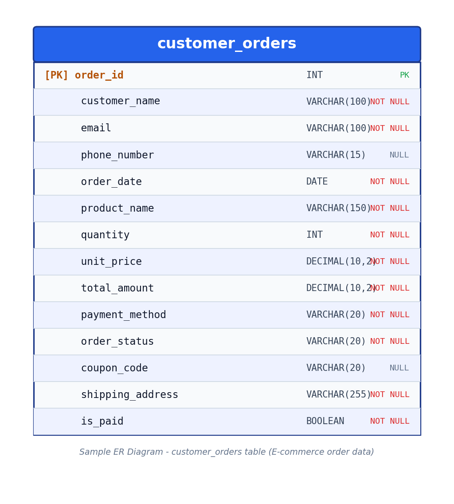

# Intelligent Test Data Simulator

> An AI-assisted synthetic test data generation tool designed for QA Automation and Software Testing workflows. Supports custom JSON schemas, complex ER Diagrams, and edge-case dataset synthesis while adhering to PDPA/data privacy standards.

🌐 **Live Demo:** [https://jiramonthon-j.github.io/test-data-simulator/](https://jiramonthon-j.github.io/test-data-simulator/)

---

## 📌 Features

- **Custom Data Synthesis:** Generate large volumes of mock datasets tailored to specific business logic (e.g., Insurance, E-Commerce, Supply Chain).
- **Edge-Case & Boundary Coverage:** Easily simulate edge-case scenarios, NULL handling, dynamic data types, and specific boundary rules for thorough QA verification.
- **Privacy Compliance (PDPA):** Creates fully synthetic data to replace production datasets, maintaining data security and privacy requirements.
- **ER Diagram & Schema Support:** Supports relational data models (e.g., Customer-Orders relationships) for backend and SQL database testing.
- **Automated Workflow:** Built-in archiving logic, volume alerts, and structured output ready for test automation pipelines.

---

## 🛠️ Tech Stack & Architecture

| Layer | Technology | Function & Role |
| :--- | :--- | :--- |
| **Frontend** | HTML5, JavaScript | Interactive configuration UI hosted on GitHub Pages |
| **Backend / Engine** | Google Apps Script (`Code.gs`) | Core data synthesis engine, dynamic rules & auto-archiving |
| **Deployment** | GitHub Pages & Web App | Serverless web integration with zero infrastructure overhead |
| **Testing Focus** | QA Automation & SQL Testing | Generates clean mock data for Playwright, Selenium, and DBs |

---

## 🚀 Key Files & Resources

- `Code.gs` — Core logic for data generation, auto-archiving (`GeneratedDatasets`), and alert automation.
- `index.html` / `Final.html` — User interface for configuring and triggering test data generator runs.
- `DEPLOY_GUIDE.md` — Step-by-step setup and deployment guide.
- `E2E_TEST_CHECKLIST.md` — Quality checklist used to verify generation logic.
- `customer_orders_er_diagram.png` — Relational schema diagram for database testing verification.

---

## 💡 Use Cases for QA Teams

1. **Database Testing (SQL):** Populate test databases with realistic data volumes to verify query performance.
2. **UI & API Automation:** Feed generated test data directly into automated test scripts (e.g., Playwright/Selenium).
3. **Regression & Boundary Testing:** Create realistic error-handling and boundary datasets for complex application logic.

---

## 📸 System Previews & Diagrams

### 1. Interactive Dashboard & Real-Time Data Preview

  

*Live Web Application UI showcasing real-time data synthesis, searching, status badges, and Human-in-the-Loop validation before database commit.*

---

### 2. Database Schema & Data Modeling

  

*Relational database schema (`customer_orders`) defining data types, constraints (NULL/NOT NULL), and boundary rules for testing.*
