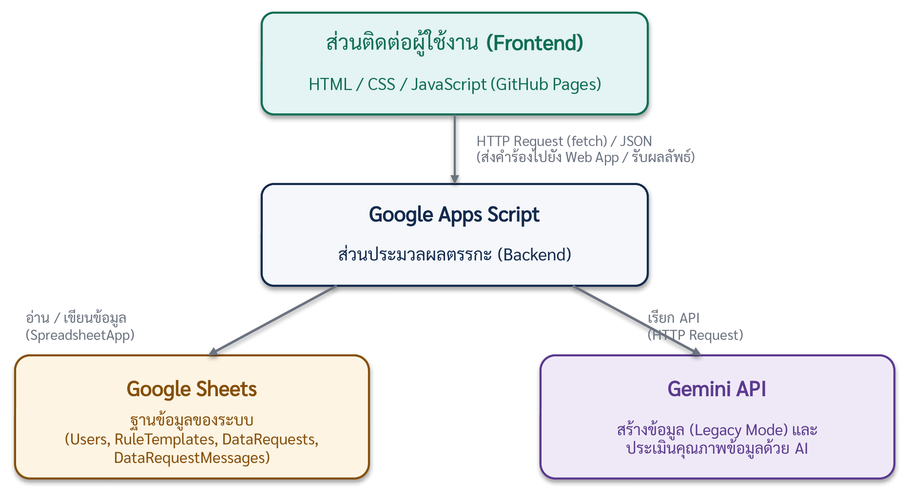
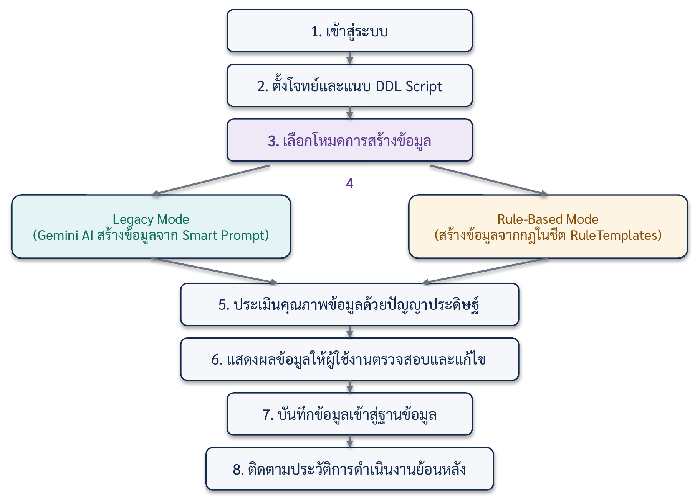
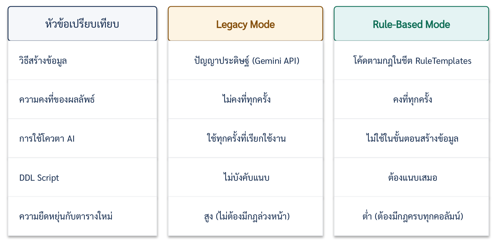
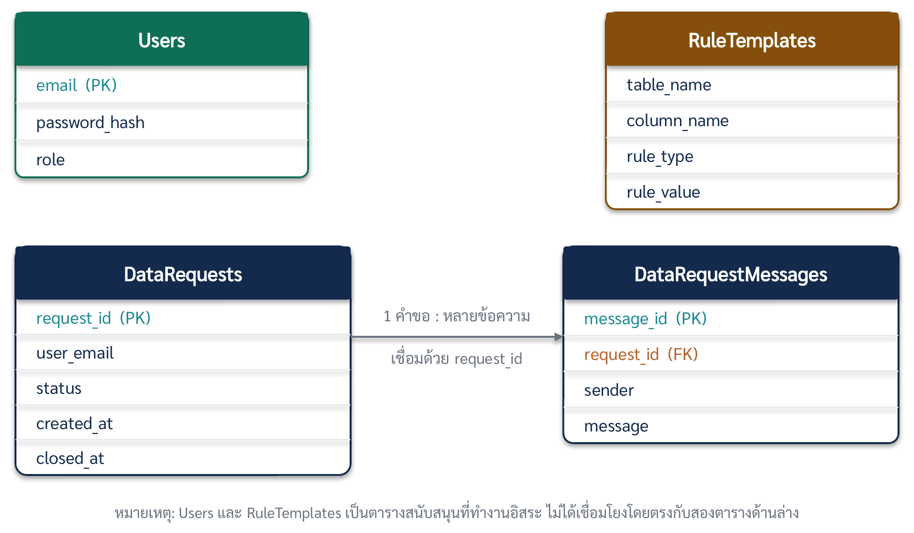

# Intelligent Test Data Simulator (ITDS)

[English](README.md) | **ภาษาไทย**


> ระบบสร้างข้อมูลจำลองสำหรับงานทดสอบซอฟต์แวร์ ใส่ DDL (`CREATE TABLE`) พร้อมเงื่อนไขเพิ่มเติมเป็นภาษาคน ระบบจะสร้างข้อมูลทดสอบที่ผ่านการตรวจคุณภาพ พร้อมสคริปต์ SQL `INSERT` ที่นำไปรันต่อได้ทันที โดยไม่ต้องใช้ข้อมูลจริงจากระบบ production (สอดคล้องแนวทาง PDPA)

🌐 **Live Demo:** [https://jiramonthon-j.github.io/test-data-simulator/](https://jiramonthon-j.github.io/test-data-simulator/)

**บัญชีทดลองใช้** (เปิดเป็นสาธารณะโดยตั้งใจ เพื่อให้ทุกคนลองเข้าใช้งานได้):

| Username | Password | Role |
| :--- | :--- | :--- |
| `Admin123` | `Abcd1234@` | Super Admin |
| `Test001` | `Abcd12345@` | QA Tester |

พัฒนาขึ้นระหว่างการฝึกงานสหกิจศึกษา (มิ.ย.–ต.ค. 2569) ที่บริษัทประกันชีวิตแห่งหนึ่ง

---

## 📌 ความสามารถหลัก

- **2 โหมดการสร้างข้อมูล**
  - **Legacy Mode (AI)** — ให้ Gemini สร้างข้อมูลจาก DDL และเงื่อนไขที่พิมพ์เป็นภาษาคน
  - **Rule-Based Mode (ใช้โค้ด)** — สร้างข้อมูลด้วยโค้ดตามกฎในชีต `RuleTemplates` (pattern, enum, ช่วงตัวเลข/วันที่, ลำดับ, เลขบัตรประชาชน, เบอร์โทร, อีเมล ฯลฯ) ไม่เสียโควตา AI และได้ผลลัพธ์สม่ำเสมอทุกครั้ง
- **รับโครงสร้างตารางได้ 2 แบบ** — SQL `CREATE TABLE` ปกติ หรือรายการคอลัมน์ที่คัดลอกจากผล Query ใน DBeaver (ชื่อคอลัมน์, ชนิดข้อมูล, ความยาว, ว่างได้หรือไม่) ระบบแปลงเป็น DDL มาตรฐานให้อัตโนมัติ
- **แม่แบบ Prompt** — กดปุ่มเดียวเติมแม่แบบเงื่อนไข ผู้ใช้แก้แค่ส่วนในวงเล็บ `[ ]`
- **DDL Enforcement** — ตรวจและปรับคอลัมน์ ชนิดข้อมูล `NOT NULL` และ `PRIMARY KEY` ให้ตรงกับ DDL ด้วยโค้ด
- **Reference Column Lock** — ดึงค่าคีย์จากชุดข้อมูลที่ Commit ไว้แล้ว เพื่อให้ตารางที่เกี่ยวข้องกันอ้างอิงค่าตรงกัน (ใช้ทดสอบ Foreign Key)
- **Quality Gate** — ตรวจคุณภาพข้อมูล (ความครบถ้วน ความถูกต้อง เงื่อนไขของตาราง) ก่อนนำเข้า Dashboard
- **ส่งออก SQL** — สร้าง `INSERT` ได้หลาย Dialect
- **จัดการสิทธิ์และ session** — บทบาท QA Tester / Super Admin, ออกจากระบบอัตโนมัติเมื่อไม่ใช้งาน, ระบบส่งคำขอและอนุมัติเมื่อไม่พบกฎของคอลัมน์

---

## 🛠️ เทคโนโลยีและสถาปัตยกรรม

| ส่วน | เทคโนโลยี | หน้าที่ |
| :--- | :--- | :--- |
| **Frontend** | HTML5, JavaScript, Tailwind CSS | หน้าตั้งค่าและใช้งาน โฮสต์บน GitHub Pages |
| **Backend** | Google Apps Script | สร้างข้อมูล ตรวจสอบ ยืนยันตัวตน อ่าน/เขียน Google Sheets |
| **AI** | Gemini API | สร้างข้อมูลตามบริบท (Legacy Mode) |
| **Storage** | Google Sheets | ผู้ใช้ กฎ ชุดข้อมูลที่สร้าง และบันทึกกิจกรรม |

<p align="center">
  
</p>

<p align="center">
  
</p>

---

## 📂 โครงสร้างโปรเจกต์

```
├── index.html                 # หน้าเว็บ (ให้บริการผ่าน GitHub Pages)
├── apps-script/               # Backend — นำไปวางใน Google Apps Script
│   ├── Code.gs                # ตัวหลัก: API, ยืนยันตัวตน/session, สร้างและตรวจข้อมูล
│   ├── RuleDispatcher.gs      # ตัวสร้างข้อมูลของ Rule-Based Mode
│   ├── RuleCompilerPrompt.gs  # Prompt สำหรับคอมไพล์กฎ
│   └── InsuranceReferenceData.gs
├── templates/
│   └── RuleTemplates_Insurance.xlsx   # ตัวอย่างกฎ
└── docs/
    ├── DEPLOY_GUIDE.md        # คู่มือติดตั้งและ Deploy
    ├── PRIVACY_POLICY.md
    ├── DEVELOPMENT_LOG.md
    ├── testing/               # แผนทดสอบ E2E และเคสสำหรับเดโม
    └── images/                # แผนภาพและภาพหน้าจอ
```

---

## 🚀 เริ่มใช้งาน

1. สร้าง Google Sheet → **Extensions › Apps Script** แล้ววางไฟล์ในโฟลเดอร์ `apps-script/`
2. เก็บ Gemini API key ใน **Script Properties** แล้วรัน `setupSheet` หนึ่งครั้ง
3. **Deploy › New deployment › Web app** (Execute as: Me, Access: Anyone) แล้วคัดลอก URL
4. ตั้งค่า `BACKEND_URL` ใน `index.html` เป็น URL นั้น แล้วเผยแพร่ด้วย GitHub Pages

รายละเอียดทั้งหมด: [`docs/DEPLOY_GUIDE.md`](docs/DEPLOY_GUIDE.md)

---

## 📸 ภาพหน้าจอ

*คลิกที่รูปเพื่อเปิดดูขนาดเต็ม*

### เข้าสู่ระบบ

<p align="center">
  <a href="https://github.com/user-attachments/assets/ace10219-48fc-435d-92a7-133c078e006e"></a>
</p>

### เปรียบเทียบโหมด

<p align="center">
  <a href="docs/images/mode_comparison.png"></a>
</p>

### Legacy Mode (AI)

<p align="center">
  <a href="https://github.com/user-attachments/assets/dd58cedb-32b3-40d0-8276-20bc469e648a"></a>
</p>

### Rule-Based Mode

<p align="center">
  <a href="https://github.com/user-attachments/assets/eb96d4aa-94ca-496c-97ad-46a12111df0f"></a>
</p>

### Quality Gate

<p align="center">
  <a href="https://github.com/user-attachments/assets/5de8d5e9-a95b-47de-b923-0f1176eaaee0"></a>
</p>

### ผลลัพธ์บน Dashboard

<p align="center">
  <a href="https://github.com/user-attachments/assets/67d5a834-75a5-4b6f-9d99-3f8e7125723a"></a>
</p>

### ตัวอย่าง SQL

<p align="center">
  <a href="https://github.com/user-attachments/assets/ee5cc31f-e466-4e9b-88be-4a08786420d4"></a>
</p>

### ER Diagram ของระบบ

<p align="center">
  <a href="docs/images/itds_er_diagram.png"></a>
</p>

---

## 💡 กรณีใช้งานสำหรับทีม QA

1. **ทดสอบฐานข้อมูล (SQL):** เติมข้อมูลที่สมจริงและเป็นไปตามเงื่อนไขของตาราง
2. **ทดสอบ UI และ API อัตโนมัติ:** ป้อนข้อมูลให้สคริปต์ทดสอบ (Playwright, Selenium)
3. **ทดสอบค่าขอบเขตและกรณีผิดพลาด:** สร้างชุดข้อมูลสำหรับ edge case ของระบบที่มีเงื่อนไขซับซ้อน

---

## 📄 สัญญาอนุญาต

เผยแพร่ภายใต้ [MIT License](LICENSE)

---

## 👤 ผู้พัฒนา

**จิรภัทร จิรมณฑล (Jirapat Jiramonthon)** — [GitHub @Jiramonthon-j](https://github.com/Jiramonthon-j)
